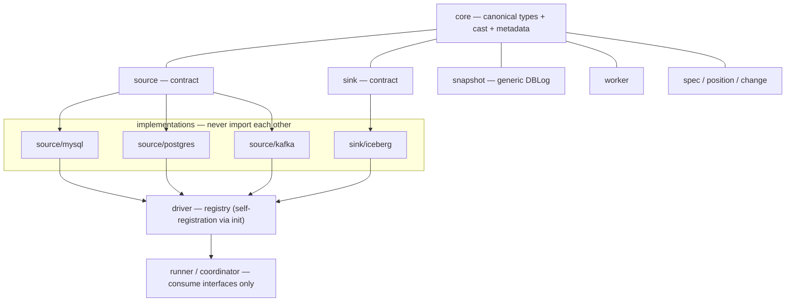

# Urutau

A CDC engine written in Go with Python authoring: replicates MySQL/Postgres/Kafka
into Iceberg **reflecting state** (upsert by PK, first-class UPDATE/DELETE),
where a single replication connection per source feeds N workers writing in
parallel — recoverable from total catastrophe.

> This repository holds the **Go engine** (coordinator, workers, CLI,
> operator). The Python SDK/planner lives in its own repository.

## Language

All code, comments, and documentation in this repository are **English**.

## Architecture

Sources and sinks are decoupled behind **public contracts** at the module root (`source`, `sink`, `driver`, `core`, `change`, `position`, `spec`): a canonical type system (`core`) crosses the source↔sink boundary, so N sources × M sinks cost N+M type mappings instead of N×M. The DBLog snapshot orchestrator is source-agnostic (`internal/snapshot`); each concrete driver is self-contained and registers itself with the driver registry (`driver`) from `init()` — the orchestration (`runner`/`coordinator`/`worker`) consumes only the contracts, never a concrete implementation. `internal/builtin` blank-imports the built-in drivers; a third-party driver registers the same way from its own module (see [`docs/plugins.md`](docs/plugins.md)).



The dependency walls are enforced by a test (`internal/architecture`) that checks direct imports via `go list` — a leak fails CI, not a future driver.

## Map

| Path | Role |
| --- | --- |
| `cmd/urutau` | CLI (`run --local`, …) |
| `cmd/coordinator` | coordinator binary (reader, router, supervisor, Flight) |
| `cmd/worker` | worker binary (Iceberg writer, Flight consumer) |
| `cmd/operator` | Kubernetes operator (CRD reconciler + webhook) |
| `core` | canonical type system (`Kind`, `Schema`, `TableRef`), cast policy, metadata catalog |
| `source` | source contract (`Source`, `Reader`, `ChunkSource`, `Capabilities`, `Runtime`, `Chunk`) |
| `sink` | sink contract (`Sink`, `TableWriter` with commit invariants, `Config`) |
| `driver` | the driver registry — `RegisterSource`/`RegisterSink`, resolved by kind/type |
| `change` | row change event, per-key collapse, batch, write mode |
| `position` | position contract (GTID/LSN/Kafka offsets, `Compare`/`Contains`) |
| `spec` | resolvedSpec + single server-side validation (metadata, cast, columns) |
| `internal/builtin` | blank-imports the built-in drivers so their `init()` registers them |
| `internal/snapshot` | generic DBLog orchestrator (chunk + caught-up proof) |
| `internal/source/mysql` | MySQL source (`go-mysql`/canal, GTID) |
| `internal/source/postgres` | Postgres source (`pgx`, pgoutput, LSN slot) |
| `internal/source/kafka` | Kafka source (franz-go, manual partition assignment, debezium-json) |
| `internal/source/kafka/decoder` | Kafka message decoders (debezium-json envelope) |
| `internal/sink/iceberg` | Iceberg writes (upsert/equality delete, `FromCanonical`, cast projection) |
| `internal/coordinator` | reader/router loops, flow budget, supervisor, control plane |
| `internal/worker` | per-table batcher + serialized committer (sink-agnostic, append/upsert mode) |
| `internal/transport` | gRPC control + Arrow Flight; generated in `internal/transport/pb` |
| `internal/eventlog` | per-run-id JSONL audit trail in S3 |
| `internal/observability` | lean Prometheus metrics + live `/statusz` |
| `test/plugin` | reference external driver (a source + sink written against only the public contracts) |
| `api/v1alpha1` | CDCPipeline CR types |
| `config/` | CRD + RBAC manifests |
| `proto/` | coordinator↔worker wire contract |

## Development

```sh
make bootstrap        # buf, golangci-lint, setup-envtest pinned into ./bin
make envtest-setup    # install the operator envtest control plane
make build            # bin/urutau, bin/urutau-coordinator, bin/urutau-worker, bin/urutau-operator
make test             # go test -race ./... (operator envtest skipped without assets)
make lint             # golangci-lint
make proto            # buf lint + generate (generated code is committed)
```

Go ≥ 1.26. No `protoc` needed — generation uses `buf` with the `protoc-gen-go`/`protoc-gen-go-grpc` plugins pinned as `go tool`.

## E2E spike

The spike proves the Iceberg write path by reading it back with Trino (trusting the read, not the commit return). Stack: RustFS (S3) + Polaris (REST catalog) + Trino (Iceberg REST catalog).

```sh
make e2e-test   # compose up --wait, then URUTAU_E2E=1 go test ./test/e2e
make e2e-down   # tear the stack down
```

It exercises append, equality delete, the `cdc.position` snapshot/table properties, the collapsed worker end to end (inline YAML → batcher → collapse → delete-then-append commits), and the full MySQL pipeline: binlog → DBLog snapshot → stream → Iceberg, with resume after downtime.
All verified through Trino. Key finding: in `iceberg-go` v0.6.0 an append and an equality delete staged in one transaction produce **two** snapshots — the delete gets the higher sequence number and applies to the freshly appended file too. A correct upsert is therefore delete-then-append (separate commits), never append-then-delete in a single commit. This is captured as an invariant on the `sink.TableWriter` contract, inherited by every future sink.

## Status

- **Sources:** MySQL (`go-mysql`/canal, GTID, heartbeat), Postgres (`pgx`, pgoutput, LSN slot), and **Kafka** (franz-go, manual partition assignment, debezium-json decoder) — one replication reader per source, mapped to the canonical type system. Kafka registers `Capabilities{Stream: true}` (no snapshot); the runner skips DBLog and streams directly from the committed offset.
- **Metadata columns:** closed catalog of pipeline metadata (`op`, `commit_ts`, `ingest_ts`, `position`, `source_table`, `phase`) landed as nullable columns at the end of the canonical schema. Declared per-table in the spec via `metadata`.
- **Per-column cast:** explicit type overrides (`cast` map on `spec.Table`) with a closed matrix — widening always, `to-string` always, narrowing/parsing never except explicit temporal reinterpretations (`timestamptz(assume_utc)`). Unmappable source types (unsigned, geometry) map to `KindUnknown` and bypass the cast.
- **DBLog snapshot:** generic in `internal/snapshot` — chunk by PK, low/high watermarks, and the caught-up proof that closes each window (never a timer; `windowTimeout` is a pathology detector). Skipped for sources without snapshot capability (Kafka).
- **Worker:** per-key collapse (upsert mode) or pass-through (append mode), strictly serialized commits per table, and DBLog window application — over the `sink.TableWriter` contract, so it is sink-agnostic. Append mode folds deletes into upserts with `op='delete'`.
- **Distributed split:** coordinator (control plane + Flight data plane, flow budget, supervisor) and workers (Flight consumer, chunk SELECTs run on the worker). Lifecycle-coupled streams — one ClientConn, keepalive, graceful drain — so a dead channel is never a silent zombie.
- **Resume:** committed position (GTID/LSN/Kafka offsets) written atomically with the data; walk-back over snapshot summaries survives compaction; async position manifests to S3 as convenience (the Iceberg property is the source of truth).
- **Supervision:** a worker that stops acking is reset (epoch bump, session cancel); resets within the window beyond the cap terminate the job — crashloops stay dead, recoverable by a fresh process with a higher epoch.
- **Eventlog:** optional per-run JSONL audit trail in S3 (`run --eventlog s3://bucket/prefix`), lifecycle + commit events.
- **Observability:** lean Prometheus `/metrics` on both binaries and a live `/statusz` on the coordinator (`--metrics-addr`).
- **Operator:** CDCPipeline CRD, coordinator StatefulSet reconciler that respects `status.terminated`, validating webhook, and an envtest suite. The operator accepts inline `definition.tables` for now; the Python planner (own repo) will render the full resolved spec.
