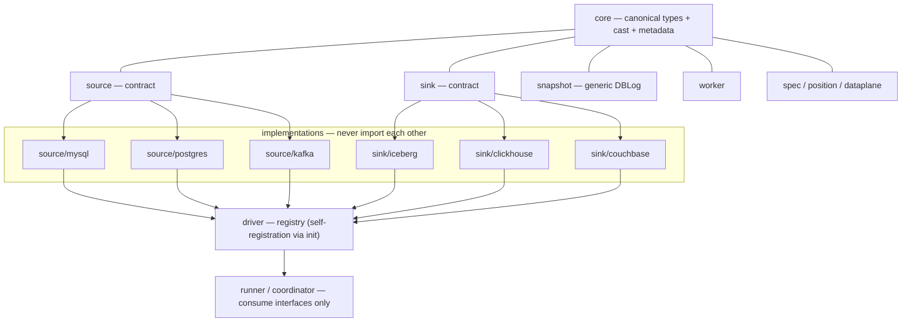

# Architecture overview

Sources and sinks are decoupled behind public contracts at the module
root — `source`, `sink`, `driver`, `core`, `dataplane`, `position`,
`spec` — not under `internal/`. A canonical type system (`core`) crosses
the source↔sink boundary, so N sources × M sinks cost N+M type mappings
instead of N×M.

The DBLog snapshot orchestrator is source-agnostic (`internal/snapshot`);
each concrete driver is self-contained and registers itself with the
driver registry (`driver`) from `init()` — the orchestration
(`runner`/`coordinator`/`worker`) consumes only the contracts, never a
concrete implementation. `internal/builtin` blank-imports the built-in
drivers; a third-party driver registers the same way from its own module.



The dependency walls are enforced by a test (`internal/architecture`) that
checks direct imports via `go list` — a leak fails CI, not a future
driver. The same test locks in that `test/plugin` imports only the public
contracts (`TestPluginPackageImportsOnlyContracts`), so the plugin seam
can't quietly grow an `internal/` dependency either.

## Repository map

| Path | Role |
| --- | --- |
| `cmd/urutau` | CLI (`run -f pipeline.yaml`, …) |
| `cmd/coordinator` | coordinator binary (reader, router, supervisor, Flight) |
| `cmd/worker` | worker binary (sink writer, Flight consumer) |
| `cmd/operator` | Kubernetes operator (CRD reconciler + webhook) |
| `core` | **public.** canonical type system (`Kind`, `Schema`, `TableRef`), cast policy, metadata catalog |
| `source` | **public.** source contract (`Source`, `Reader`, `ChunkSource`, `Capabilities`, `Runtime`, `Chunk`) |
| `sink` | **public.** sink contract (`Sink`, `TableWriter` with commit invariants, `Config`) |
| `driver` | **public.** the driver registry — `RegisterSource`/`RegisterSink`, resolved by kind/type |
| `dataplane` | **public.** columnar batch (`Batch` — record, watermark, write mode, snapshot state) |
| `position` | **public.** position contract (GTID/LSN/Kafka offsets, `Compare`/`Contains`) |
| `spec` | **public.** resolvedSpec + single server-side validation |
| `test/plugin` | reference external driver — a source + sink written against only the public contracts |
| `internal/builtin` | blank-imports the built-in drivers so their `init()` registers them |
| `internal/snapshot` | generic DBLog orchestrator (chunk + caught-up proof) |
| `internal/source/mysql` | MySQL source (`go-mysql`/canal, GTID) |
| `internal/source/postgres` | Postgres source (`pgx`, pgoutput, LSN slot) |
| `internal/source/kafka` | Kafka source (franz-go, manual partition assignment, debezium-json/raw/avro decoders) |
| `internal/source/kafka/decoder` | Kafka message decoders |
| `internal/sink/iceberg` | Iceberg writes (upsert/equality delete, `FromCanonical`, cast projection) |
| `internal/sink/clickhouse` | ClickHouse sink (`ReplacingMergeTree` upsert, tombstone deletes, position-as-column resume) |
| `internal/sink/couchbase` | Couchbase sink (key-document upsert, `_urutau` metadata sub-object, control-document position, fast/atomic commit modes) |
| `internal/coordinator` | reader/router loops, flow budget, supervisor, control plane |
| `internal/worker` | per-table batcher + serialized committer |
| `internal/enrich` | broadcast hash join enrichment (reference maps, cold-start buffer, point-in-time) |
| `internal/transport` | gRPC control + Arrow Flight; generated code in `internal/transport/pb` |
| `internal/eventlog` | per-run-id JSONL audit trail in S3 |
| `internal/observability` | lean Prometheus metrics + live `/statusz` |
| `internal/architecture` | import-boundary tests — enforces the walls in the diagram above |
| `api/v1alpha1` | CDCPipeline CR types |
| `config/` | CRD + RBAC manifests |
| `proto/` | coordinator↔worker wire contract |

## E2E spike

The suite proves the write path by **reading it back** — Iceberg through
Trino, ClickHouse through its own `FINAL` reads, Couchbase through
independent SDK reads — rather than trusting a successful commit. Stack:
MySQL + Postgres (sources), RustFS (S3) + Polaris (REST catalog) + Trino, a
ClickHouse container, and a Couchbase container (single-node, 0-replica
bucket — the configuration where synchronous durability works). A separate
Redpanda overlay (`test/e2e/docker-compose.kafka.yml`) adds a Kafka
broker + Confluent-compatible schema registry for the Kafka+Avro suite.

```sh
make e2e-test         # compose up --wait, then URUTAU_E2E=1 go test ./test/e2e
make e2e-down         # tear the stack down
make e2e-kafka-up     # + the Redpanda overlay, for Kafka+Avro tests
make e2e-test-kafka   # run just the Kafka+Avro round trip
make e2e-kafka-down
```

It exercises append, equality delete, the `cdc.position` snapshot/table
properties, and the full MySQL pipeline — binlog → DBLog snapshot →
stream → Iceberg, with resume after downtime.

**Key finding:** in `iceberg-go` v0.6.0, an append and an equality delete
staged in **one** transaction produce two snapshots, and the delete gets
the higher sequence number — it also deletes the freshly appended file. A
correct Iceberg upsert is therefore delete-then-append in **separate**
commits, never append-then-delete in one. The underlying principle is what
the `sink.TableWriter` contract states as its invariant — *the position
must never advance past durably written data* — and each sink encodes it
with its own mechanism: Iceberg via delete-then-append with the position
on the last commit, ClickHouse via the position traveling on every row of
a single INSERT.
