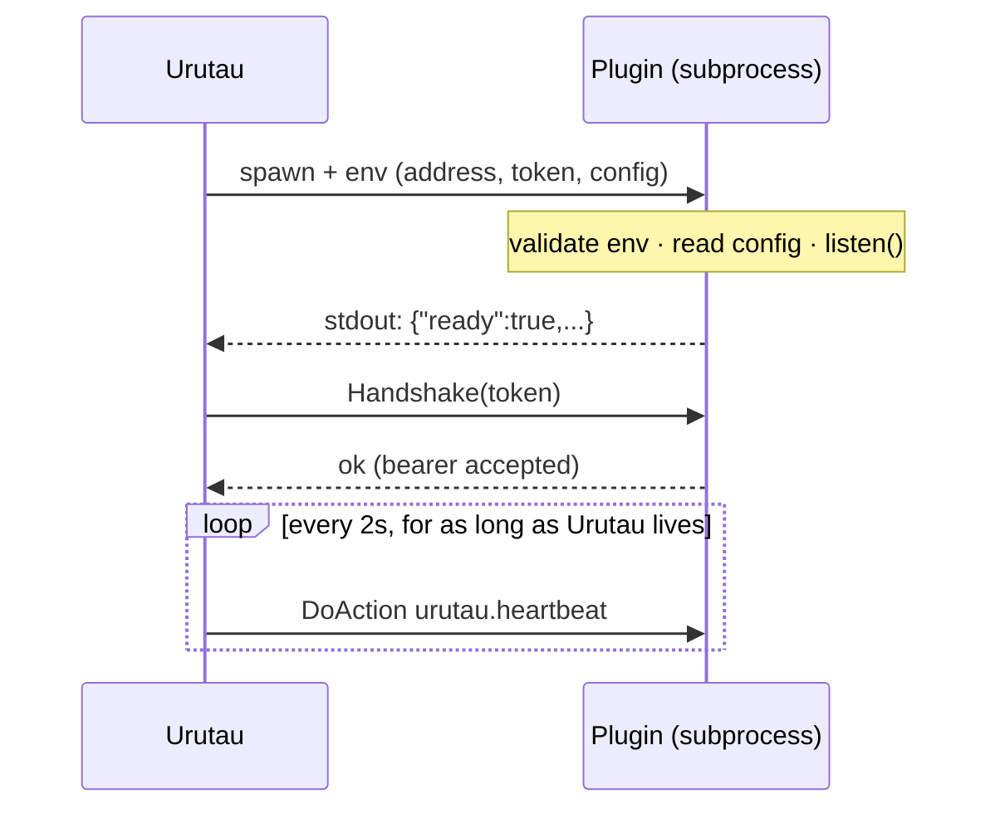
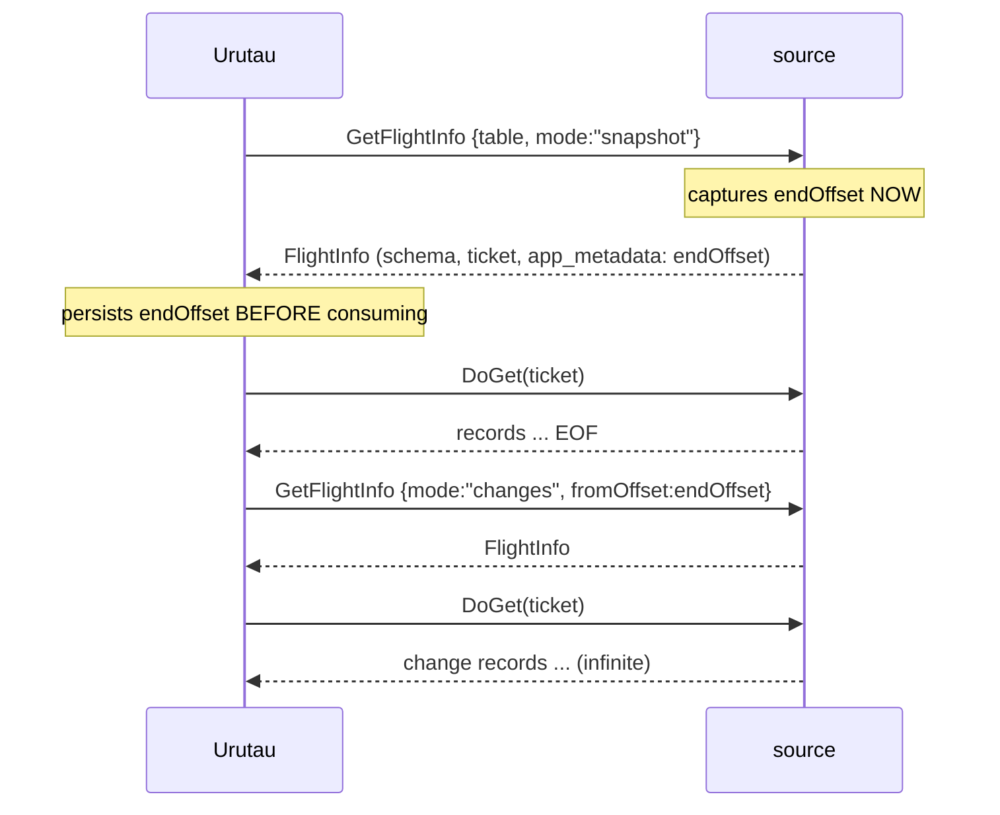

# Urutau Plugin Contract

**Protocol:** `arrow-flight` · **protocolVersion:** 1 · **Status:** normative

This document defines the contract between Urutau and plugins. Audience: an implementer with **no access to Urutau's source code**. If two implementations follow this document, they interoperate. If this document conflicts with any SDK, tutorial, or README, **this document wins**. The normative language of this document is English; translations are informative only.

The key words **MUST**, **MUST NOT**, **REQUIRED**, **SHOULD**, and **MAY** are to be interpreted as described in RFC 2119.

Conventions: `base64` always means RFC 4648, standard alphabet, with padding. JSON is always UTF-8, no BOM, a single object.

## 1. Roles

- The **plugin is an Arrow Flight server** (gRPC). **Urutau is the client.**
- The plugin imports nothing from Urutau. Any language, any runtime, as long as it speaks Arrow Flight plus this document.
- Two roles: **source** (produces records) and **sink** (consumes them). The role arrives via `URUTAU_STAGE`. In v1, a binary serves one role per execution.



## 2. Process lifecycle

### 2.1 Startup sequence

1. Urutau creates the runtime dir (`0700` perms), the listen address, the token, and the config file.
2. Urutau spawns the binary with the environment of §2.2.
3. The plugin validates the environment, reads the config, creates the Flight server, and `listen`s on the given address.
4. The plugin writes the **readiness line** to stdout (§2.3) — **only after** `listen()` is accepting connections.
5. Urutau connects and performs `Handshake` with the token (§4).
6. From here on: stdout is the log channel (§2.4), and the anti-orphan watchdog counts heartbeats (§2.6).

### 2.2 Environment variables

| Variable | Required | Value |
|---|---|---|
| `URUTAU_STAGE` | yes | `source` or `sink` |
| `URUTAU_TOKEN` | yes | base64 of 32 random bytes (the bearer, §4) |
| `URUTAU_CONFIG` | yes | absolute path to a JSON file (`0600`) with the user's config |
| `URUTAU_PLUGIN_DIR` | yes | absolute path to the plugin's install directory |
| `URUTAU_PROTOCOL_VERSION` | yes | integer: the maximum protocol version Urutau speaks |
| `URUTAU_SOCKET` | §2.2.1 | path of a unix socket (Linux/macOS) or named pipe (Windows) |
| `URUTAU_BIND` | §2.2.1 | TCP address (`127.0.0.1:0`) — fallback mode |

**2.2.1** — exactly **one** of `URUTAU_SOCKET` / `URUTAU_BIND` is present.

Rules:

- A required variable missing or invalid → **exit 2** with a clear message on stderr. Without `URUTAU_TOKEN`, the plugin **MUST NOT** even open a listener: exit 2 immediately.
- `URUTAU_CONFIG`: the user's config, already interpolated; Urutau has already validated it against the package's `config.schema.json`. The plugin **SHOULD** re-validate. Secrets live in that file — the plugin **MUST NOT** log config values or leak them in error messages.
- `URUTAU_BIND` ending in `:0` means an ephemeral port: bind and report the real port in readiness (§2.3).

### 2.3 Readiness

First line of stdout, within **30s** of spawn, max **8KB**, ends with `\n`:

```json
{"ready":true,"protocolVersion":1,"pid":4242}
```

- `ready` — **MUST** be `true`.
- `protocolVersion` — integer, the version **actually spoken** (negotiation rules in §14).
- `pid` — **MAY**.
- `port` — integer, **REQUIRED only in TCP mode** (`URUTAU_BIND`); absent otherwise.

The line **MUST** be written with an immediate flush. Classic bug: buffered stdout, the line sits in the buffer, Urutau times out at 30s and kills a plugin that was ready. If your language buffers stdout, solve this before anything else.

Before the readiness line, **nothing** goes to stdout — startup logs go to stderr. After `ready`, stdout becomes the log channel (§2.4).

Anything other than that line — timeout, exit before ready, stray text — Urutau kills the process and reports the **stderr tail** (last 64KB) as the failure cause. Startup stderr is your error channel: use it.

### 2.4 Logging

- stdout (after readiness): **SHOULD** be one JSON object per line — `{"ts":"<RFC3339>","level":"debug|info|warn|error","msg":"..."}` plus free-form fields. Urutau re-emits with the plugin's prefix. A non-JSON line is re-emitted as raw info.
- stderr: free format, forwarded with a prefix. No normative limit.

### 2.5 Signals and exit codes

| Code | Meaning | Urutau's reaction |
|---|---|---|
| `0` | clean shutdown | normal flow |
| `2` | invalid config/env | **no restart** — retrying won't help |
| anything else | crash | restart with backoff |

- `SIGTERM` → graceful shutdown, **the same path** as the `urutau.shutdown` action (§11.5): stop accepting RPCs, finish the record in flight, `exit 0` within 15s.
- `SIGINT` → same (a convenience for manual development).
- The plugin **MUST** handle both signals.

### 2.6 Anti-orphan watchdog — **REQUIRED**

If Urutau dies, the plugin **MUST** die on its own:

1. Urutau calls `urutau.heartbeat` every **2s** while alive (reverse guarantee, §15).
2. The plugin keeps the timestamp of the last heartbeat received.
3. No heartbeat for **15s** → `exit 1`.
4. The check runs with granularity ≤ 1s.
5. The heartbeat **MUST** respond in **< 1s even under heavy streaming load** — the handler must not contend on the data-path lock.

This is contract, not an implementation suggestion: without it, a `kill -9` on Urutau leaves your plugin running forever on the user's machine.

## 3. Transport

- **Linux/macOS**: unix domain socket (path in `URUTAU_SOCKET`).
- **Windows**: named pipe (path `\\.\pipe\...` in `URUTAU_SOCKET`) **or** TCP `127.0.0.1` with the port in readiness.
- **gRPC**: max recv message **32 MiB** (both sides); client keepalive ping every 30s; backpressure is HTTP/2 flow control — the plugin **MUST NOT** buffer unboundedly in front of the network.
- The plugin **MUST** support ≥ **8 concurrent DoGet/DoPut streams** (multi-table pipelines).
- A CDC stream silent for 60s: the plugin **MAY** send an empty batch (0 rows) as a liveness signal — and **MUST** tolerate client pings with no data.

## 4. Authentication

1. Urutau calls `Handshake` with payload = the UTF-8 bytes of the `URUTAU_TOKEN` value.
2. The plugin validates it against the env value (comparison **SHOULD** be constant-time).
3. Invalid token → `UNAUTHENTICATED`, connection terminated. No fallback.
4. Valid token → respond with a `HandshakeResponse` with empty payload.
5. Every subsequent RPC carries the gRPC metadata `authorization: Bearer <URUTAU_TOKEN>`.
6. Any RPC without a valid bearer → `UNAUTHENTICATED`. **No exceptions — heartbeat included.**

Rationale: the socket isolates from other **users** on the machine; the bearer isolates from other **processes of the same user**.

## 5. RPC map

| RPC | source | sink |
|---|---|---|
| `Handshake` | MUST | MUST |
| `GetFlightInfo` | MUST | — |
| `GetSchema` | MAY | — |
| `DoGet` | MUST | — |
| `DoPut` | — | MUST |
| `DoAction` (§11) | MUST | MUST |
| `ListActions` | MUST | MUST |
| `CancelFlightInfo` | MUST | — |

`ListActions` **MUST** list every action the plugin implements — it is discovery and a debugging tool.

## 6. `GetFlightInfo` — discovery

**Request**: `FlightDescriptor.descriptor` = UTF-8 bytes of a JSON object:

```json
{"table":"orders","mode":"snapshot"}
{"table":"orders","mode":"changes","fromOffset":"YmluLWFsZ28="}
```

- `table`: string, 1–256 bytes. **Opaque to Urutau** — table, collection, topic: whatever makes sense to the plugin.
- `mode`: `"snapshot"` | `"changes"`.
- `fromOffset`: **optional**, base64 of opaque bytes ≤ 256. Only in `changes`. Absent = "from the earliest available point" (the plugin decides what that means).
- Unknown JSON fields: the plugin **MUST** ignore them (future compatibility).

**Response (`FlightInfo`)**:

| Field | Rule |
|---|---|
| `schema` | the schema of the stream for that mode (§7 snapshot / §8.1 changes) |
| `endpoints` | **exactly 1** endpoint |
| `endpoints[0].ticket` | opaque bytes generated by the plugin, ≤ 8KiB — Urutau merely echoes it in `DoGet` |
| `ordered` | `true` |
| `total_records` | **MAY** — an estimate (snapshot progress bar) |
| `app_metadata` | JSON — see below |

`app_metadata`:

- `snapshot`: **REQUIRED** `{"endOffset":"<base64>"}` (semantics in §7).
- `changes`: **MAY** `{"estimatedLag": <int>}`.

**Ticket rules**: opaque to Urutau; valid for as long as the process that issued it lives (minimum 10 min); it **does not survive** a plugin restart — after any process restart, Urutau always re-issues `GetFlightInfo` and gets a fresh ticket.

**Repeated calls**: `GetFlightInfo` **MUST** be safe to call any number of times, with no destructive side effect on the backend (I3, §13). For snapshot, each call **MAY** capture a different `endOffset` (the current position) — the one that counts is from the `FlightInfo` actually used.

**Errors**: unknown table → `NOT_FOUND`. A `fromOffset` the plugin itself emitted but has since purged/expired → `FAILED_PRECONDITION` with a human-readable hint (e.g. "binlog rotated; re-run the snapshot").

## 7. `DoGet` — snapshot

- Request: the ticket from the `FlightInfo`.
- **Finite** stream: schema (1st message), batches, EOF.
- Empty table: schema + 0 batches + EOF — **MUST** work, `endOffset` and all.
- The snapshot **MUST** reflect the exact state of the backend at the instant the `endOffset` was captured (I1, §13).

The `endOffset` does **not** come at the end of the stream — it comes in `FlightInfo.app_metadata`, **before** any record. Urutau persists the `endOffset` **before** consuming the snapshot. A crash mid-snapshot → Urutau re-runs it from the same point. No gray zone, no overlap, no gap.



## 8. `DoGet` — changes (CDC)

- **Infinite** stream: it ends only by error, cancellation (§12), or shutdown.
- The schema is the change record of §8.1. **Fixed within the stream** — the plugin **MUST NOT** evolve the schema mid-stream (evolution = a new `GetFlightInfo` and a new stream).

### 8.1 Change record schema (v1, fixed)

| # | column | Arrow type | nullable | description |
|---|--------|-----------|----------|-------------|
| 0 | `op` | `Utf8` | no | `"c"` = insert, `"u"` = update, `"d"` = delete — exactly these three values in v1 |
| 1 | `before` | `Struct` of the table's schema columns | column optional; row null on `"c"` | prior state |
| 2 | `after` | `Struct` of the table's schema columns | row null on `"d"` | new state |
| 3 | `offset` | `Binary` | no | ≤ 256 bytes, opaque (§8.2) |
| 4 | `ts_source` | `Timestamp(ns, "UTC")` | yes | event timestamp **at the origin**; unknown → null |

- Column order **MUST** be exactly this.
- `before`/`after`: the same fields (name, type, order, nullability) as the table's snapshot schema. Field metadata **MAY** differ.
- `before` **MAY** be omitted entirely (a plugin without before-images). If present, it **MUST** have the shape above — never a struct with different fields.

### 8.2 Offset rules

- Opaque to Urutau — it is the plugin's cookie.
- **Unique** per table within the process: the plugin **MUST NOT** emit the same offset twice for the same table (this is what enables dedup at the sink).
- **The cut-point property** — the heart of the contract: for **any** closed prefix of the stream (end of batch or EOF), the `offset` of the last record emitted is a valid `fromOffset` whose resumption **does not re-emit any record** from that prefix.
- A received `fromOffset` **MUST** have been emitted by the plugin itself. Unknown/purged → `FAILED_PRECONDITION`.

### 8.3 Silence

No changes for 60s: the plugin **MAY** send an empty batch (0 rows, schema intact). The client expects this and **MUST** ignore it as data.

## 9. Delivery semantics (the plugin's view)

- End-to-end: **at-least-once**, ordered per table. Interleaving across tables is free.
- Urutau commits offsets only after the sink confirms a flush. The plugin does not participate in that commit — but §8.2 is what makes it work.
- Practical consequence: the plugin **MAY** receive `DoGet(changes)` with a `fromOffset` older than the last offset it emitted (a crash between Urutau's flush and commit). This is normal, expected, and is at-least-once semantics in action — it is not an error, do not treat it as one.

## 10. Sink: `DoPut` + flush

- `DoPut` descriptor: `{"mode":"write","table":"orders"}` — `table` is a free-form string (table, topic, index).
- **The 1st message of the stream carries the schema.** The plugin validates that it can write it; rejection → `INVALID_ARGUMENT` **on the first batch**, not the tenth.
- Subsequent messages: records. The plugin **MAY** buffer internally.
- **`urutau.flush` returns success only when everything received up to that point is durable** (WAL/fsync/commit). This is the only acceptable definition of flush — it is what Urutau's checkpoint stands on.
- An additive new column in the input schema: the sink **SHOULD** accept it (source evolution).
- **Idempotency**: the sink **MUST** write idempotently by primary key (upsert). `plugin.yaml` declares `capabilities.idempotentWrite`; if `false`, Urutau disables auto-restart for the pipeline — replaying non-idempotent writes is silent corruption.
- `DoPut` acks (`PutResult`/app_metadata): v1 **ignores them**. Durability is flush's job.

## 11. Actions (`DoAction`)

Format: `Action.type` = the action name; payload in the `buf` bytes (UTF-8 JSON when present). Response: **one** `ActionResult` with JSON in the body. **All actions require the bearer** (§4).

### 11.1 `urutau.list_tables` — source: **MUST** · sink: MAY

Empty request. Response:

```json
{"tables":[{"name":"orders","supportsSnapshot":true},{"name":"users","supportsSnapshot":false}]}
```

### 11.2 `urutau.status` — **MUST**

Empty request. **NEVER fails** — it is the diagnostic instrument while the pipeline is dying:

```json
{"state":"streaming","tables":{"orders":{"offset":"Ymlu...","lagEvents":12}},"uptimeSec":184}
```

`state` ∈ `idle | snapshotting | streaming | draining | error`. `tables.<name>.offset` = last offset emitted (base64). `lagEvents`: MAY.

### 11.3 `urutau.heartbeat` — **MUST**

Empty → empty. **< 1s** always (§2.6).

### 11.4 `urutau.flush` — sink: **MUST** · source: MAY

Empty → ok. Semantics from §10.

### 11.5 `urutau.shutdown` — **MUST**

Empty → ok. After responding: stop accepting RPCs, finish the record in flight, `exit 0` within 15s.

## 12. `CancelFlightInfo`

The plugin **MUST** honor it: terminate the `DoGet` whose ticket matches the endpoint of the request's `FlightInfo`, release resources — the client sees the stream end. The `RELEASE` variant is optional in v1.

## 13. Invariants (the testable summary)

- **I1 — Snapshot→CDC continuity**: `DoGet(changes, fromOffset = the snapshot S's endOffset)` yields exactly the changes that occurred **after** S's state. No gap, no overlap.
- **I2 — Cut-point**: §8.2. Every closed prefix of the stream has a valid resume offset.
- **I3 — Harmless discovery**: `GetFlightInfo` does not mutate backend state.
- **I4 — Zero orphans**: Urutau dies → the plugin dies (§2.6).
- **I5 — Ordering**: changes for the same table always arrive in total order, across any restart.

A plugin's conformance = the MUST rules of this document + these five invariants.

## 14. Versioning

- `protocolVersion` is an integer. Current: **1**.
- **Additive** change (new action, new optional field) → **no bump**. **Breaking** change (CDC schema, offset semantics, contract of an existing action) → major bump.
- **Negotiation**: `v = max{ v' ≤ URUTAU_PROTOCOL_VERSION that the plugin speaks }`. If none exists → **exit 2 before readiness** with clear stderr ("plugin speaks v2, Urutau announced v1"). If one exists → speak `v` and announce `v` in readiness. Urutau rejects anything it doesn't know.
- A protocol version stays supported for 2 Urutau majors before removal.

## 15. Urutau's guarantees (reverse contract)

The plugin may count on:

- `urutau.heartbeat` every 2s for as long as Urutau lives — the basis of §2.6.
- `urutau.shutdown` **before** SIGTERM; SIGTERM only after a 15s wait.
- A config in `URUTAU_CONFIG` already validated against the package's `config.schema.json`; a complete, valid environment.
- **Exactly one client** connecting to the address; the token exists only between Urutau and the plugin (file/env with correct perms).
- Every received `fromOffset` was emitted by the plugin itself — Urutau **never fabricates offsets**.
- Urutau bugs are no excuse to violate I1–I5 — but report them, because then the bug is Urutau's and gets fixed on this side of the contract.

## 16. Conformance checklist

*(this checklist is also the spec for `urutau plugin validate --smoke`)*

**Process**
- [ ] exit 2 on a missing/invalid required env var; without a token, no listener is opened
- [ ] readiness: first stdout line, exact JSON, immediate flush, only after `listen()`
- [ ] nothing on stdout before readiness; startup logs on stderr
- [ ] SIGTERM/SIGINT → exit 0 within 15s
- [ ] watchdog: 15s without heartbeat → exit 1; heartbeat responds < 1s under load

**Transport/auth**
- [ ] listens on `URUTAU_SOCKET` or `URUTAU_BIND` (real port in readiness)
- [ ] Handshake validates the token; every RPC requires the bearer; no bearer → `UNAUTHENTICATED`
- [ ] ≥ 8 concurrent streams; tolerates data-less pings

**Source**
- [ ] `GetFlightInfo`: JSON descriptor, 1 endpoint, opaque ticket, `ordered`, `endOffset` in `app_metadata` (snapshot)
- [ ] finite snapshot; empty table (schema + 0 batches + EOF) works
- [ ] CDC uses the exact §8.1 schema — column order, types, `op` limited to `"c"`/`"u"`/`"d"`
- [ ] offset unique per table; cut-point property (I2)
- [ ] purged `fromOffset` → `FAILED_PRECONDITION` with a hint
- [ ] `CancelFlightInfo` terminates the stream

**Sink**
- [ ] `DoPut` validates the schema on the 1st batch; rejects with `INVALID_ARGUMENT`
- [ ] `urutau.flush` = durable, no exceptions
- [ ] idempotent writes by PK

**Actions**
- [ ] `list_tables` / `status` / `heartbeat` / `shutdown` (+ `flush` if sink) with the exact JSON
- [ ] `status` never fails
- [ ] `ListActions` lists everything implemented

## 17. Examples

Change records for a table `(id: int64, qty: int32)`:

| op | before | after | offset | ts_source |
|----|--------|-------|--------|-----------|
| `"u"` | `{id:7, qty:2}` | `{id:7, qty:3}` | `0x01 0x9f` | `2025-06-01T12:00:00.123456789Z` |
| `"d"` | `{id:8, qty:1}` | `null` | `0x01 0xa0` | `2025-06-01T12:00:01.000000000Z` |
| `"c"` | *(before column: null)* | `{id:9, qty:5}` | `0x01 0xa1` | `2025-06-01T12:00:02.500000000Z` |

---

*End of file.*
